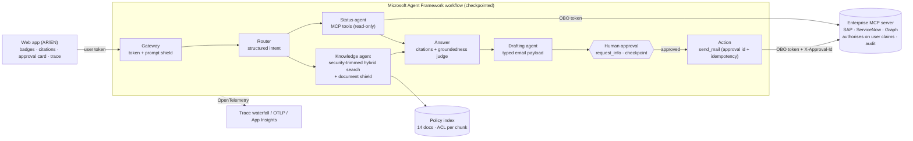

# Corporate Services Assistant — critical-path prototype

A small, working prototype of the **critical path** from the pre-sales recommendation: a bilingual (Arabic / English)
assistant for HR, Finance, Procurement and IT that answers from approved policies, looks up the employee's own records,
drafts outputs, and **only acts after human approval**.

It runs on a laptop at zero cost (Ollama + local models). It uses the same patterns as the target Azure design, and an
Azure mode is included as a config switch.

> **One journey, end to end.** *"ما حالة الفاتورة 5100-2291؟ وإذا كانت متأخرة، جهّز لي رسالة متابعة"*
> ("What is the status of invoice 5100-2291? If overdue, draft a follow-up.")
> gateway → router → **SAP lookup with the user's identity** ∥ **permission-trimmed policy search** → grounded answer
> with citations → typed email draft → **workflow pauses for approval** → send → full trace + audit.

---

## What it demonstrates (mapped to the brief)

| Brief asks for | Where it is in the code |
|---|---|
| Document ingestion & retrieval | `app/knowledge/ingest.py`: heading-aware chunking, metadata, ACLs, multilingual embeddings (BGE-M3). `app/knowledge/search.py`: hybrid BM25 + vector with reciprocal-rank fusion and Arabic normalisation |
| Permission-aware grounding | Every chunk carries `allowed_groups`. The search filters on the **signed token's** groups *before* ranking (the Azure AI Search security-filter pattern), so restricted documents never reach the model |
| Tool / function calling | `app/tools/enterprise_mcp.py`: a mock SAP / ServiceNow / Graph **MCP server**. The status agent calls it through Agent Framework's `MCPStreamableHTTPTool`, carrying an **on-behalf-of token**; the server authorises on the user's claims |
| Structured output | Router, answer, judge and draft all use JSON-schema structured outputs (pydantic). The draft is a typed payload with facts, sources, citations, autonomy level and idempotency key |
| Human approval step | `ApprovalExecutor` calls `ctx.request_info(...)`. The workflow **pauses and checkpoints**, then **resumes from the checkpoint in a fresh workflow instance**. Write tools need an approval record, and write tools are *never* exposed to the model |
| Evaluation | `evals/run_evals.py`: 30-question AR/EN golden set, 152 permission-leakage checks, 8 adversarial tests (direct and indirect injection, exfiltration, privilege). Gates match the deck |
| Tracing | OpenTelemetry spans from Agent Framework (workflow, executors, model calls, MCP tool calls) plus app spans (gateway, retrieval, safety, approval). They appear as a waterfall in the UI and can be exported via OTLP or to App Insights |
| Security controls | Prompt shield on input and on retrieved documents, spotlighting of untrusted content, output PII / external-email checks, internal-recipient allow-list, audit log |

## Architecture



### Local prototype vs. the production design in the deck

| Concern | This prototype | Production (deck) |
|---|---|---|
| Chat model | `qwen2.5:7b` via Ollama (8k context) | `gpt-5-mini` on regional provisioned throughput, UAE North |
| Embeddings | `bge-m3` (multilingual) via Ollama | In-region embedding model chosen by the Arabic benchmark (gate G2) |
| Retrieval | In-process hybrid index + security filter | Azure AI Search (hybrid + semantic ranker, `allowed_groups` filter or native ACLs) + Foundry IQ |
| Identity | Locally signed JWTs + simulated OBO exchange | Entra ID SSO, OBO, Entra Agent ID |
| Tools | FastMCP server with mock SAP / ServiceNow / Graph data | MCP servers behind API Management, calling SAP OData, ServiceNow and Graph |
| Safety | Heuristic prompt shields (Azure Content Safety if configured) | Azure AI Content Safety Prompt Shields + APIM content-safety policy |
| State | File checkpoints | Cosmos DB checkpoint storage |
| Tracing | In-memory + optional OTLP | Azure Monitor / Application Insights + Foundry tracing |

## Quick start (macOS, 16 GB RAM)

```bash
brew install python@3.12 ollama        # if not installed
./scripts/setup_mac.sh                  # venv, deps, pulls qwen2.5:7b + bge-m3 (~6 GB), builds the index
./scripts/start.sh                      # MCP tool server + web app  →  http://localhost:8000
```

Use the sample buttons under the chat, or type your own question. Switch persona (top right) to see permissions change.

| Persona | Groups | Try |
|---|---|---|
| Sara, Finance officer | Staff, FIN-Requesters | Invoice + draft (AR/EN); restricted playbook (trimmed); someone else's invoice (denied by SAP) |
| Layla, Legal counsel | Staff, LEGAL | Same playbook question, now answered from the Legal-only document |
| Omar, IT engineer | Staff, IT-Team | ServiceNow ticket status |
| Huda, HR compensation | Staff, HR-Team, HR-COMP | Confidential salary bands (visible only to her) |

Other commands:

```bash
make eval-quick      # 8 golden questions + all security tests (~3-4 min locally)
make eval            # full evaluation → evals/reports/eval_report.md
make test            # pytest suite (uses the scripted test double; no model needed)
make reset           # clear audit/approvals/outbox before recording
make offline         # replay mode with the scripted test double if no model is available
python -m app.cli --persona sara --approve --trace "What is the status of invoice 5100-2291? Draft a follow-up."
```

Optional: `docker run -p 18888:18888 -p 4317:18889 mcr.microsoft.com/dotnet/aspire-dashboard` and set
`OTEL_EXPORTER_OTLP_ENDPOINT=http://localhost:4317` to view the same traces in the Aspire dashboard.

## Azure mode (optional, untested)

`infra/azure-setup.sh` creates Azure OpenAI (gpt-5-mini + embeddings), AI Search (Free) and Content Safety, and prints
the `.env` values. Then `pip install -r requirements-azure.txt && python -m app.knowledge.ingest --azure`.
The code path is the same OpenAI-compatible v1 API; the Azure adapters (`AzureSearchIndex`, Content Safety, App Insights)
were written against the SDKs but **not run** as part of this prototype.

## Evaluation

The harness mirrors the gates in the deck: retrieval recall per language, groundedness, citation accuracy, intent and
tool-call accuracy, answer correctness per language and the AR–EN gap, **0 permission leaks (blocking)**,
**attack success ≤ 1% (blocking)** and p95 latency. Security tests are deterministic and pass in every mode.
Quality numbers from a local 7B model (with the same model as judge) are indicative. The production plan uses gpt-5-mini
and the Foundry evaluators, and the latency gate assumes cloud inference rather than a laptop.

## Honest limitations

- Synthetic data and mock systems (the documents, invoices and tickets are fictional). The identity provider is simulated.
- A local 7B model is noticeably weaker than gpt-5-mini, especially in Arabic, and slower (roughly 10–30 s per turn on
  Apple silicon). Deterministic fallbacks for tool calls and routing are logged and shown in the UI when used.
- Security trimming reflects permissions at index time. Production needs incremental permission sync (the deck states
  ≤ 4 h lag, agreed with cyber).
- The "security-trimmed" panel is shown for the demo only; a production UI would not reveal restricted document IDs.
- The scripted model (`scripted_llm/`) is a rule-based test double for CI and offline replay. It is not an AI model.

## Project layout

```
app/
  config.py  identity.py  llm.py  safety.py  telemetry.py  server.py  cli.py
  knowledge/  corpus/*.md (14 docs, AR+EN, ACLs)  ingest.py  search.py  arabic.py
  tools/      enterprise_mcp.py (SAP/ServiceNow/Graph mock, MCP)  client.py
  workflow/   models.py  prompts.py  executors.py  build.py
  static/     index.html  app.js  styles.css
evals/        golden_set.jsonl  adversarial.jsonl  leakage_probes.json  run_evals.py
tests/        test_security.py  test_workflow.py
scripted_llm/ server.py (OpenAI-compatible test double)
infra/        azure-setup.sh      scripts/  setup_mac.sh start.sh stop.sh reset_demo.sh
```
